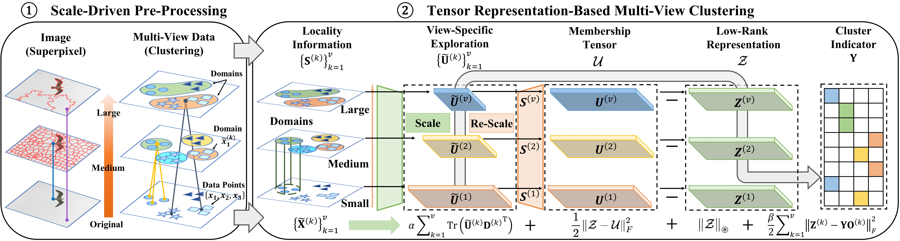

## Scale-Driven Tensor Representation-Based Multi-View Clustering

This is the source code for the following paper:

C. Zhang, L. Chen, W. Ding, K. Zhao, Z. Shi, Y. Wang, and C. L. P. Chen, “Scale-Driven Tensor Representation-Based Multi-View Clustering,” IEEE Transactions on Neural Networks and Learning Systems (Under Review).

 

|                                                                                                                                                                                                                                                                                                                                                                                                                                                                                                                                                                                                                                                                                                                                                                                                                                                                                                                                                  |
|:-------------------------------------------------------------------------------------------------------------------------------------------------------------------------------------------------------------------------------------------------------------------------------------------------------------------------------------------------------------------------------------------------------------------------------------------------------------------------------------------------------------------------------------------------------------------------------------------------------------------------------------------------------------------------------------------------------------------------------------------------------------------------------------------------------------------------------------------------------------------------------------------------------------------------------------------------------------------|
| Fig.1 Illustration of the proposed SDTR algorithm. The proposed method is a two-stage framework, including scale-driven pre-processing and multi-view clustering based on unified structural features. In the first stage, a scale-driven pre-processing algorithm is employed to extract multi-scale features from the raw data and capture the local relationships across different scales. The domains in this pre-processing method can be analogized to different-sized receptive fields in neural networks, which encode the data into high-order features with varying scales. In the second stage, our approach treats the features at various scales as multi-view data and utilizes a novel multi-view fuzzy clustering algorithm to directly obtain the final cluster indicator. By fusing the membership features from different scales, our approach effectively learns clusters of arbitrary shapes while preserving the local details of the data.  |

 

Some commonly used multi-view datasets can be found in this [dataset repository](https://github.com/ChuanbinZhang/Multi-view-datasets.git)

Run "demo.m" to test the SDTR algorithm. The code has been tested in Matlab R2018b on a PC with Windows 10.
