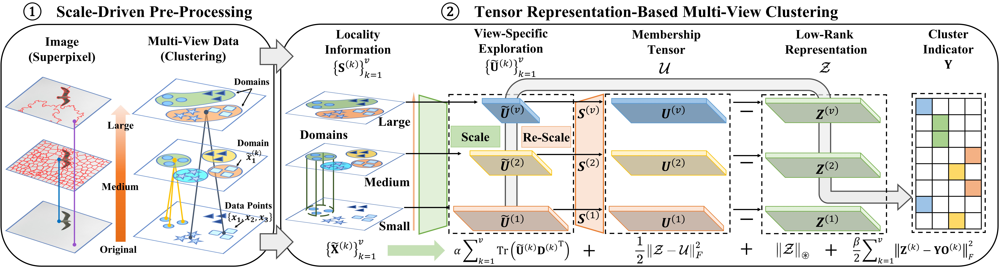

## Scale-Driven Tensor Representation-Based Multi-View Clustering

This is the source code for the following paper:

C. Zhang, L. Chen, W. Ding, K. Zhao, Z. Shi, Y. Wang, and C. L. P. Chen, "Scale-Driven Tensor Representation-Based Multiview Clustering," IEEE Transactions on Neural Networks and Learning Systems, early access, 24 Apr. 2025, doi: 10.1109/TNNLS.2025.3558613.

 

|                                                                                                                                                                                                                                                                                                                                                                                                                                                                                                                                                                                                                                                                                                                                                                                                                                                                                                    |
|:---------------------------------------------------------------------------------------------------------------------------------------------------------------------------------------------------------------------------------------------------------------------------------------------------------------------------------------------------------------------------------------------------------------------------------------------------------------------------------------------------------------------------------------------------------------------------------------------------------------------------------------------------------------------------------------------------------------------------------------------------------------------------------------------------------------------------------------------------------------------------------------------------------------------|
| Fig.1 Illustration of the proposed SDTR algorithm. It consists of two stages: (1) a scale-driven pre-processing approach and (2) a tensor representation-based multi-view clustering algorithm. In the first stage, scale-driven pre-processing captures local relationships across multiple scales, analogous to analyzing local details through a hierarchical scaling process. This procedure extracts multi-scale features from the raw data and transforms typical data and images into a unified multi-view data structure. In the second stage, the proposed method treats the features at various scales as multi-view data and utilizes a novel multi-view fuzzy clustering algorithm to directly obtain the final cluster indicator. By fusing the membership features from different scales, our approach effectively learns clusters of arbitrary shapes while preserving the local details of the data. |

 

Some commonly used multi-view datasets can be found in this [dataset repository](https://github.com/ChuanbinZhang/Multi-view-datasets.git)

Run "demo.m" to test the SDTR algorithm. The code has been tested in Matlab R2018b on a PC with Windows 10.
